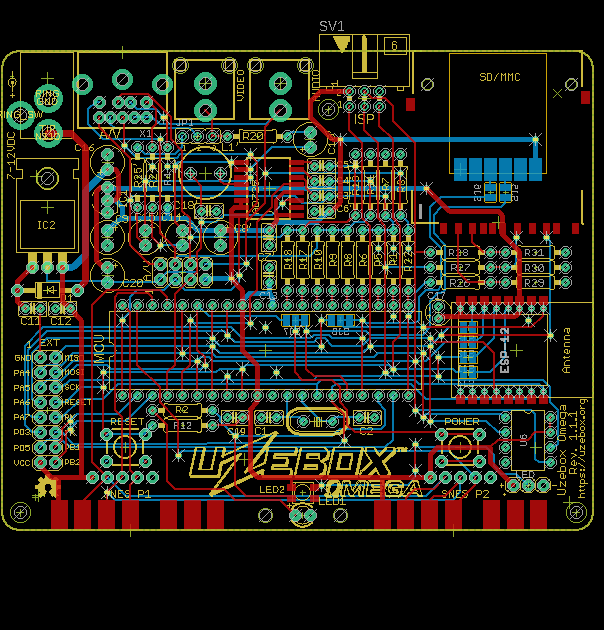
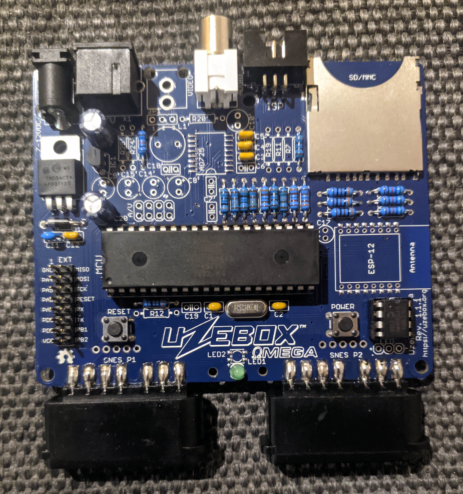
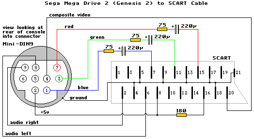

The Uzebox Omega is a modified version of the Uzebox open source games console that fits into the official Uzebox case and supports RGB SCART without the need for the expensive AD725 video chip.

## What is the same
* General schematic and functions inherited from the Uzebox v1.3.3.
* Mechanical dimensions. All buttons, connectors, holes, etc. are in the same place, so you can use the original case.

## New features
* SCART RGB support. Because space is too limited for the giant SCART connector, we use a Sega Mega Drive 2 compatible 9 pin Mini DIN connector and cables.

* The AD725 chip and its surrounding parts are optional now. If you don't populate them RGB video works but you cannot use the composite video RCA jack.
* Optional footprint for an USB to serial module on the bottom side below the SD card socket. You can use this as a power supply connector to power your Uzebox from a USB wall plug. Also you can use it for debug messages, it is connected to the second UART of the AVR CPU. This leads to some small incompatibilities, so you have to activate it by a couple of solder jumpers on the bottom side. See instructions below.
* You can use an WS2812 "Neopixel" LED instead of the normal LED. There is no Uzebox kernel software for this yet. It uses the same pin as the original LED. A connector for adding more WS2812 LEDs is present so maybe you can create a colourful Uzebox sign in the top of your case?
* Added mounting holes for the lightpipe. You can screw or tie it to the board instead of glueing.
* I overworked all the traces to use a cleaner layout.
* The ESP12 WiFi chip can be connected to the CPU's SPI and reset lines. With this it should be possible to flash the AVR MCU via WiFi but we would need a custom Uzenet/ESP8266 firmware to enable this.

## SVideo adapter
The SVideo signals are routed to unused pins 5 (LUMA) and 6 (CHROMA) of the mini DIN socket so it should be possible to create a 9 pin mini DIN to SVideo adapter or cable.
 
## Instructions for using the ESP's SPI connection
The ESP's SPI pins GPIO12, 13 and 14 can be connected to the SPI lines of the AVR CPU so you have a very fast communication line between the two CPUs. GPIO16 can also be connected to the reset of the AVR. It should be possible to flash the AVR from the ESP with this. Four solder jumpers on the bottom of the PCB under the ESP would need to be bridged to enable this.

## Instructions for using the USB to serial module
WARNING: You have to leave out the 5V regulator if you want to use USB as power source!!!

The module has to be soldered to the bottom side of the PCB under the SD card socket. Because we cannot use holes there as they would conflict with the SD card, you have to solder the module directly onto the pads, or solder some angled pin hedaers onto the pad and put the module onto these. This method is perferred because it gives you a bit of distance between the SD card and the USB socket.

There are two solder jumpers near the module. They are open by default. So the module is connected to nothing, only to 5V for power supply.
If you close these jumpers the serial lines of the module will be connected to the second serial port of the AVR CPU. Because these are used by the standard Uzebox power button and ESP_RST pin there are two solder jumper which may connect these to PA5 and PA6 instead. This would need a software modification for software that uses the power button or the ESP_RST pin.

These jumpers are connected by a small wire in compatibility position. Without cutting these lines everything is like the original Uzebox.

## Instructions for WS2812 LED
If you want a colourful Neopixel LED instead of the normal one, just solder a WS2812 mini LED instead of the normal one. You can also skip the LEDs resistor then. There is a 3-pin connector at the right side of the PCB to connect more LEDs but don't overload the power supply!
Keep in mind that controlling such LEDs requires precise timing so it might be tricky to control such LEDs during video output.

## To find out more, please check out the project's sites:
* [Uzebox Omega PCBWay Shared Project](https://www.pcbway.com/project/shareproject/Uzebox_Omega_games_console_77d0d74a.html): Buy a pre-assembled Uzebox Omega from PCBWay.
* [Uzebox Omega Assembly Guide](https://github.com/danboid/uzebox-omega/blob/main/schematics/Uzebox-Omega/V1.1.1/Uzebox-Omega-V1.1.1-assembly-guide.md): How to build a Uzebox Omega.
* [Uzebox Omega Wiki page](https://uzebox.org/wiki/Omega): Uzebox Omega wiki page including build instructions, revision history etc.
* [Getting started](https://uzebox.org/wiki/Getting_Started_on_the_Uzebox): How to install the toolchains, IDEs and build the codebase. Then move on to tutorials and the rest of the documentation.  
* [Main website](https://uzebox.org): The main hub with news, links, downloads and more.
* [Forums](https://uzebox.org/forums): Share your new game and discuss everything Uzebox.
* [Wiki](https://uzebox.org/wiki): All of the Uzebox project's documentation.
