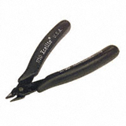
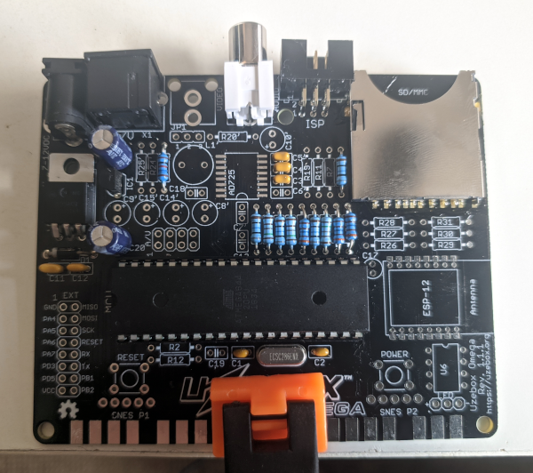
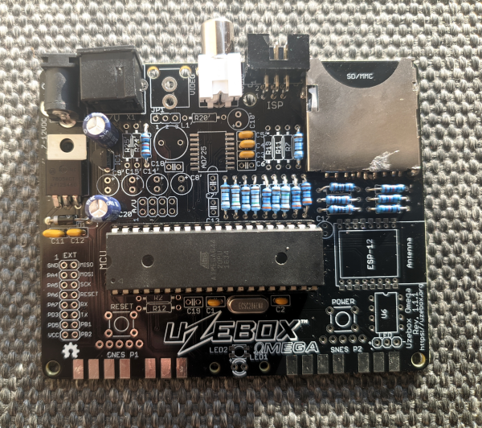

# Uzebox Omega assembly guide
For Uzebox Omega Revision V1.1 to v1.4

> [!NOTE]  
> This assembly guide was written with consideration of the electronics beginner who only has a minimal set of tools. Some of the methods described in this guide are makeshift solutions for those without more professional tooling. Use the method which works best for you.

## Revision History
| Version | Date | Author | Description |
| :---- | :---- | :---- | :---- |
| 0 | 01-Nov-2012 | A.Bourque | Initial release |
| 1 | 6-Nov-2012 | A.Bourque | Minor corrections |
| 2 | 28-Jan-2014 | A.Bourque | Minor changes |
| 3 | 27-Jan-2015 | A.Bourque | Added replacement parts for EXT header and SD card socket |
| 4 | 21-Feb-2015 | A.Bourque | Added preliminary troubleshooting section |
| 5 | 26-Nov-2015 | A.Bourque | Minor improvements |
| 6 | 1-Feb-2016 | A.Bourque | Added note regarding power button |
| 7 | 15-Nov-2016 | A.Bourque | Added notes for PCB rev 1.3.1 and references to the Uzenet interface. |
| 8 | 13-Aug-2024 | A.Bourque | Ported the assembly guide to GitHub and added minor improvements. |
| 9 | 28-Aug-2024 | D.MacDonald | Several additions and improvements. |
| 10 | 17-Sep-2024 | D.MacDonald | Add solder flux, a video cable and a SNES controller to the "Other parts required" table. |
| 11 | 11-Jul-2025 | D.MacDonald | Started work on modifying the Uzebox assembly guide for the Uzebox Omega. |

## Parts list verification
> [!IMPORTANT]  
> Ensure you have all the required parts before starting, 

<!--
> [!TIP] 
> Click on the images for a bigger view.
-->
| Component Image | Schematic Reference | Description |
| ----- | ----- | ----- |
|  | N/A 		 | Uzebox Omega printed circuit board (PCB).    <b>NOTE:</b> This tutorial was made using PCB rev 1.1.1. Later revisions may have a slightly different arrangement, but part references will stay the same. For example, Uzebox Omega V1.2 to V1.4 use RCA sockets with a different footprint compared to Omega < v1.1.X, later revisions use slots for the power adapter and have support for using a microSD socket. Relevant differences will be described in the assembly steps.  You may also notice a different colour and revision of the Uzebox PCB being used in some photos. This assembly guide is a modified version of the Uzebox assembly guide and I didn't think it was necessary to update or replace all of the images. If you are good at photography and would like to help update and improve any or all of the images used in this guide then please get involved.   		 |
|  | N/A 		 | DC power jack 		 |		 		 |
|  | AUDIO 		 | Audio output RCA jack (Red or white) - optional		 |
|  | X1 		 | A female, 9 pin mini DIN socket 			 		 |
|  | ISP 		 | Right-angled Atmega644 programming ports are preferred over vertical ones. 					 		 |
|  | EXT 		 | Extension port header - optional		 |
|   | MCU 	 | DIP-40 socket for the Atmega644 							 |
|   | POWER / RESET  | Tactile 	switches (x2) 				 |
|   | SD/MMC 		 | Secure Digital memory card socket. One of the two possible models has a soldering wing on the right side only. |
|   | SNESP1 SNESP2 	 		 | SNES gamepad connectors (x2)			 		 |
|   | C1,C2 		 | 18pF ceramic capacitors		 		 |
|   | C3,C4,C5, C12 	 | .10uF (100nF) ceramic capacitors 	 |
|   | C11 | .33uF (330nF) ceramic capacitor 	 |		 |		 |
|   | R2,R26, R27,R28  | Resistor 301Ω 1% (Orange, black, brown, black, brown) 		 |
|   | R29,R30, R31, video fix | Resistor 562Ω 1% (Green, blue, red, black, brown) 	 |
|   | R3,R6,R10,R18 		 | Resistor 806Ω 1% (Gray, black, blue, black, brown)	 |
|   | R5,R9,R17	 | Resistor 1.58KΩ 1% (Brown, green, gray, brown, brown)  |
|   | R1,R8,R22	 | Resistor 3.16KΩ 1% (Orange, brown, blue, brown, brown) 	 |
|   | MCU 	 | ATmega644 microcontroller 			 		 |
|   | XTAL | 28.63636Mhz crystal  |			 		 |
|   | IC1 	 | 3.3V voltage regulator  |
|   | IC2 	 | 5.0V voltage regulator 		 |
|   | D1  | Rectifier diode 			 |
|   | LED1	 | Power	LED  |
|   | U6	 | SPI SRAM socket - optional |
|   | U6	 | 1Mb (128KB) SPI SRAM IC - optional |

## Tools required

To assemble this kit you will need the following tools:

| Tool | Description |
| :---: | ----- |
|  | A basic soldering iron, 25W-40W. |
|   | Solder, rosin core, 60/40 type. |
|   | Long nose pliers. |
|   | Regular cutters will do fine, but shear cutters will do a better job. |
|   | A basic multimeter is not essential but highly recommended for verifications and troubleshooting. |
|   | An AVR ISP programmer. Required to flash the Atmega644 microcontroller. Alternately, you can flash the Atmega using [avrdude](https://uzebox.org/wiki/Avrdude) and the GPIO header of a Raspberry Pi or similar.|

## Other parts required

| Part | Description |
| :---: | ----- |
|   | A standard 7-12VDC barrel connector power supply with a center-positive, 5.5x2.1mm tip. See the text BOM for a few suitable DigiKey PSUs. |
|   | A Sega Mega Drive 2 / Sega Genesis 2 compatible 9 pin mini DIN to RGB SCART cable. [Shielded, CSYNC cables](https://uzebox.org/wiki/Uzebox_SCART_Interface#SCART_cables) are recommended for the best sound and video quality. |
|   | A [SNES controller.](https://uzebox.org/wiki/FAQ#Where_can_I_buy_Uzebox_compatible_controllers?) |
|   | Solder flux. Not strictly required but flux makes it much easier to solder the SNES connectors and SD card socket.|

## Building the kit
### Assembling the power supply section

<table>
    <tr>
        <td width="50%"></td>
        <td>If your power jack is too far out of alignment it can prevent you correctly inserting the mini din AV socket. I use Blu Tack or some other putty-like adhesive to keep the power jack correctly aligned whilst soldering it.</td>
    </tr>
    <tr>
        <td></td>
        <td>Insert the DC barrel jack. It is recommended that you start by soldering the power jack first. The main reason being it is quite easy to solder the power jack at an angle with the PCBs that use the circular power jack footprints instead of using slots, as used on later revisions of the Omega. The power jack can be tricky to desolder if you don't own a desoldering station/gun so if you mess up by not soldering the power jack on straight enough then you may as well start over with a new PCB if you don't own any desoldering tools.  Bend the pins on the soldering side to keep it held firmly in place. To ensure it's soldered flat, you can also put the 40 pin DIP socket underneath the PCB to level it up. Be sure to put plenty of solder on the three pins so that the jack is securely mounted.</td>
    </tr>
    <tr>
        <td width="50%"></td>
        <td>Using pliers, bend the pins of <b>IC2</b>, the 5V voltage regulator, at a 90 degrees angle as pictured. Alternately, insert the legs into the PCB up to the notches then bend the top part until it is lying flat on the PCB. Whilst holding the regulator flat, use the edge of a ruler or maybe a file to bend the regulators legs flat against the PCB on the underside of the board.</td>
    </tr>
    <tr>
        <td></td>
        <td>Mount <b>IC2</b> on the PCB along diode <b>D1</b>. Notice the diode has a white stripe on one end to indicate the direction of current. Ensure the band matches with the component’s drawing on the PCB. As with all future components you will solder, when inserting a component, bend its pins on the other side of the PCB so it holds in place.  Flip the PCB and solder all pins.</td>
    </tr>
    <tr>
        <td></td>
        <td>Using the cutters, cut the pins excess wire. It is recommended that you wear eye protection when using wire cutters. You should hold wires whilst cutting them to stop the wire bits flying into someones eye.</td>
    </tr>
    <tr>
        <td></td>
        <td>Add <b>C11</b> (.33uF), <b>C12</b> (100nF), <b>C16</b> (1uF), <b>C20</b> (1uF) and <b>IC1</b> (3.3v regulator). The electrolytic capacitors (the black or dark blue cans) have a polarity. The negative pin is marked with a white stripe and little minus signs on the side. Ensure the opposite pin (the longest one) inserts in the hole which has a little "+" next to it. Solder all pins and remove excess wire. That completes the power supply section.</td>
    </tr>
    <tr>
        <td></td>
        <td>If you have a multimeter, let’s test what we have so far. Switch your multimeter to DC voltage measurement mode. Plug in the power supply and probe pin 1 and 7 on the P1 SNES connector footprint. If all goes well, you should measure around 5V. Unplug the power.  If you aren't getting around 5V, check your soldering. It's more likely to be a soldering issue than faulty components if you are new to soldering and the components are new. Heat up your soldering iron and touch up all of the solder joints made so far on the underside of the PCB then try another voltage measurement.  If you have a hot air gun you can try reflowing the joints. Heating the solder until you can see it start to melt without then using a solder sucker or wick to remove any of it can often fix substandard or faulty solder joints.</td>
    </tr>
</table>

### Assembling the microcontroller and sound section

<table>
    <tr>
        <td width="50%"></td>
        <td>Add the DIP-40 socket and ensure the DIP socket notch is aligned with the MCU's notch as drawn on the PCB. Whilst holding the DIP socket in place on the PCB, you can use a ruler or a file to bend the sockets legs inwards to hold it steady whilst soldering. Add <b>XTAL</b> (crystal), <b>C1</b> and <b>C2</b> (18pF), <b>R3</b> (806Ω), <b>R22</b> (3.16KΩ), <b>AUDIO</b> jack (white or red) and the <b>ISP header.</b></td>
    </tr>
    <tr>
        <td></td>
        <td>Insert the <b>MCU</b> (ATmega644) into the DIP-40 socket. Notice one end of the chip has a notch. You must insert the MCU so that this notch is aligned with the notch in the MCU silkscreen outline drawn on the top of the PCB.  To test that the audio jack and microcontroller are working, we need to use <b>avrdude</b> to flash the fuse settings of the microcontroller and also write a <b>.hex</b> of a Uzebox game to it. This requires that you connect your Uzebox's ISP header to a USB port on your computer using any avrdude compatible programmer.  The commands to flash the fuse settings and Uzebox ROM are covered on the Uzebox wiki's <a href="https://uzebox.org/wiki/Avrdude">Avrdude page.</a> Note that your Uzebox does not need to be powered when using avrdude, it is recommended that it is disconnected from the mains during the flashing process.  You can use any Uzebox rom that you can find a .hex file for to do this audio test, the only requirement is that the rom must automatically start playing music or sound because you'll be testing without a controller at first. The Arkanoid demo in the Uzebox github repository starts playing music as soon as it runs. I prefer to use <a href="https://uzebox.org/forums/viewtopic.php?p=33065#p33065">IKD.hex</a> because it's a good example of the Uzebox sound engine.</td>
    </tr>
    <tr>
        <td></td>
        <td>Connect the RCA audio jack of the Uzebox to an RCA input on an amplifier or a TV with a RCA audio input jack. Make sure the volume of the TV or amp is about half way up and then attach power to the Omega. The Uzebox powers on automatically and boots straight into whichever ROM you chose to flash so you should be able to hear your chosen rom running if all is well.  Congratulations if you can hear it, give yourself a pat on the back!</td>
    </tr>
</table>

### Assembling the video section

<table>
    <tr>
      <td width="50%"></td>
      <td>Assemble the video DAC by soldering <b>R1</b> (3.16KΩ), <b>R4</b> (162Ω), <b>R5</b> (1.58KΩ), <b>R6</b> (806Ω), <b>R8</b> (3.16KΩ), <b>R9</b> (1.58KΩ), <b>R10</b> (806Ω), <b>R17</b> (1.58KΩ), <b>R18</b> (806Ω) and <b>C3</b> (100nF), <b>C4</b> (100nF), <b>C5</b> (100nF). Cut all remaining pins and solder the 9 pin mini din socket.  NOTE: <b>R4</b> wasn't required by Uzebox v1.3.3. If you don't have a 162Ω resistor you can use one in the range 150Ω to 220Ω.</td>
    </tr>
    <tr>
        <td> </td>
        <td>Connect the SCART cable to your TV, then plug in power. If you are using a CSYNC cable and your TV is configured to the right input, you should be able to see the video and hear the audio output from your Uzebox on your TV. Give yourself a double pat on the back!  If you are using a CVBS cable or an OSSC converter, you have to apply the <a href="https://uzebox.org/wiki/Omega#Known_issues_and_fixes">video sync fix.</a> It is recommended that all Omega users of versions v1.0 to v1.4 apply the video sync fix.</td>
    </tr>
</table>

### Assembling the SD card section

<table>
    <tr>
        <td width="50%"></td>
        <td>The SD card socket is the trickiest component to solder, as the only SMD component of the Omega. Make sure the PCB is well lit and do not try to to solder the SD card socket if its late, you're angry or intoxicated.  If your SD socket includes one, keep the plastic retainer in place when soldering. It is recommended that you apply a thin layer of solder flux to the SD socket pads before soldering and that you use both a narrow gauge of solder wire, such as 0.3 to 0.5 mm and use a narrow, finely pointed soldering iron tip.  If you have a PCB assembly station or some helping hands availble to keep the board steady then you'll want to use them when soldering the SD socket, otherwise you may wish to clamp the PCB to your desk to keep it steady.  You may find it helpful to solder the two SD socket pads that are nearest to the edge of the PCB first to keep it anchored before you solder the rest of the SD socket legs.  Feel free to remove the MCU from its DIP socket to give you a bit more room whilst soldering and try to avoid soldering the SD socket legs to the case of the SD card socket.</td>
    </tr>
    <tr>
        <td></td>
        <td>Complete the SD interface by soldering the voltage dividers <b>R26</b>(301Ω), <b>R27</b>(301Ω), <b>R28</b>(301Ω), <b>R29</b>(562Ω), <b>R30</b>(562Ω) and <b>R31</b>(562Ω) and then use <b>avrdude</b> to flash the <a href="https://uzebox.org/forums/viewtopic.php?t=9405">bootloader (Bootloader5.hex)</a> to the Uzebox so that you can test the SD card socket works by powering on your Uzebox and then inserting a <a href="https://uzebox.org/wiki/FAQ#What_is_the_recommended_way_to_format_a_SD_card_for_use_with_the_Uzebox?">FAT16 formatted SD card</a> with some <b>.uze</b> files on it to see if the bootloader lists the programs on the card. If it does, you're well on your way to having a fully working Uzebox.</td>
    </tr>
</table>

### Assembling the remaining parts

<table>
    <tr>
        <td></td>
        <td>Solder the SNES connectors. It is highly recommended that you apply some solder flux to the SNES connector pads before positioning the connectors, this will help the solder stick to the pads.  If you have the <a href="https://uzebox.org/wiki/3D_printed_case">3D printed Uzebox case</a> then the best way to solder the SNES connectors is to screw the Uzebox into the lower part of the case, align the connectors and then solder them whilst the PCB is in the case. Otherwise, you can use the following method.  If you don't have the Uzebox case, the Uzebox PCB needs to be raised by a few millimeters so that the pins of the SNES connectors lie flat on the pads with no gap. You can use a couple of credit/swipe cards stacked upon one another or several sheets of paper inserted below the PCB (but not under the connectors) to elevate the PCB to the right height so that the connector pins lie flat on the pads.  Hold the connectors firmly and center the pins in the middle of the pads, ensuring that there is no gap between the connector casing and the PCB. Once the connector is correctly positioned, use a small amount of Blu Tack or similar putty to keep the connectors in place whilst soldering. Having a SNES controller connected whilst soldering will prevent any of the pins getting misaligned by the heat of the soldering iron.  Begin soldering by heating just the pad for a second or two then both the pin and the pad then add solder, a lot of solder! Gently stroke the solder from the pin to the pad to bond the two. It’s easier to solder pins at both extremities of the connector first. The SNES connector plastic won't withstand a ton of heat before becoming loose, so solder them quickly. Use enough solder to ensure it will have good mechanical resistance.  After soldering the SNES connectors you can run the <a href="https://uzebox.org/wiki/Controller_Tester">Controller Tester</a> program, <b>ControllerTester.uze</b> from the demos folder of the Uzebox github repository to test that your joypads, joysticks and buttons all function correctly.</td>
    </tr>
    <tr>
        <td width="50%"></td>
        <td>Add the <b>RESET</b> and <b>POWER</b> switches, <b>R2</b>(301Ω) and <b>LED1</b>. The longest pin on the LED is the anode and must be inserted in the hole with a little <b>+</b> next to it. Ensure the tactile switches are mounted horizontally as pictured.  You can also optionally solder the EXT header if you want to experiment with <a href="https://uzebox.org/wiki/UART">UART and UART MIDI</a> or you wish to use the Uzenet module via the EXT header. If you're not using a <a href="https://uzebox.org/wiki/ESP8266">Uzenet module</a> you can add 128 KB of SPI SRAM by adding an 8 position DIP socket and an SPI RAM chip. Remember to get the notch aligned when inserting the SPI DIP socket or the chip itself.</td>
    </tr>
    <tr>
        <td></td>
        <td>Plug a Uzebox compatible joystick or joypad into the P1 port, connect the mini DIN socket to your SCART TV (or SCART to HDMI converter). insert a FAT16 formatted SD card containing some <b>.uze</b> files and then insert the power cable to test everything.  <a href="https://uzebox.org/wiki/Tornado_2000">Tornado 2000</a> is useful to test the SD card socket because it won't run without a data file stored on the SD card.<a href="https://uzebox.org/forums/viewtopic.php?t=11717">Uzemod</a>, a MOD music file player, and UzeboxPC, an 8086 emulator that lets you run CP/M are useful for testing SPI RAM because they won't run without it. You also need a <a href="https://uzebox.org/wiki/Uzebox_Keyboard_Interface">Uzebox PS/2 keyboard adapter</a> to run UzeboxPC.  Do not try to use the bare Uzebox on a metal or any other conductive surface without it being encased in at least the bottom half of a case to prevent shorts and damage to the hardware. It is recommended that you build the Uzebox 3D printed case or design your own to help protect it.  <b>IMPORTANT</b> The Uzebox bootloader (aka the <b>Gameloader</b>) allows you to load games stored on SD card. To enter the bootloader, hold any button on the P1 controller while pressing and releasing the reset button. Whilst in a game, you can push <b>Select+Start+Y+B</b> to reset the game and get back to the gameloader.  Have fun!</td>
    </tr>
</table>

## Troubleshooting
Head to the [Uzebox forum](https://uzebox.org/forums) for support assembling the Uzebox Omega. The [Uzebox wiki](https://uzebox.org/wiki) also contains a wealth of information.

## Assembly guides for older Uzebox versions
To assemble older version of the Uzebox (before version 5.0 / F5), you can refer to the [archived assembly guide](http://uzebox.org/files/UzeboxAssemblyGuideV1.7.pdf).

## Recommended AVR ISP Programmers 
An ISP programmer is required to flash the ATMega644 with the bootloader and games. Common models are:
* Atmel/Microchip AVRISP MK2 clones (Digikey, Amazon, AliExpress)
* Olimex AVR-ISP-MK2 (Mouser)
* Arduino (Everywhere. Search for "USBASP AVR programmer")

 

Pictures and content of this document are released under a [Creative Commons Attribution-Share Alike 3.0 Unported License](http://creativecommons.org/licenses/by-sa/3.0/).  
Uzebox is a reserved trademark.  
Copyright © Belogic   
